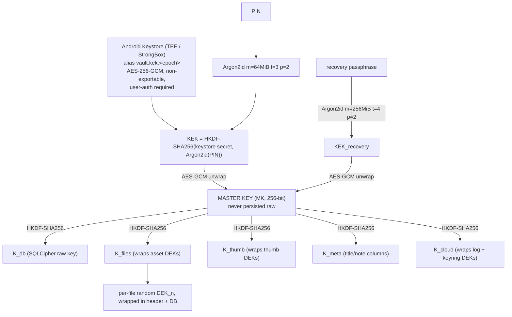

# Threat Model

> Extracted from `docs/ARCHITECTURE.md` §8.7 (threat table), §1.3 (explicit non-goals), and §8.1 (key hierarchy). No new threats or claims have been added; wording is taken from the source document.

## 1. What the architecture explicitly does not try to do

(from ARCHITECTURE.md §1.3)

- It does not protect data on a rooted or malware-compromised device while the vault is unlocked.
- It does not prevent a hostile cloud from *withholding* updates (freshness/rollback by omission). It detects tampering and reordering, not silence. See §8.7.
- It does not guarantee exact export file sizes. It guarantees `maxBytes` as a hard constraint that may fail, and `targetBytes` as best effort.
- It does not attempt deduplication of identical documents across devices in v1 (a naive content-addressed scheme would leak the presence of known documents).

## 2. Key hierarchy summary

(from ARCHITECTURE.md §8.1)

```
                    ┌───────────────────────────────────────┐
                    │   Android Keystore (TEE / StrongBox)  │
                    │   alias: vault.kek.<epoch>            │
                    │   AES-256-GCM, non-exportable,        │
                    │   setUserAuthenticationRequired(true)  │
                    └──────────────────┬────────────────────┘
                                       │ unwraps (requires biometric/credential)
   PIN ──Argon2id(m=64MiB,t=3,p=2)──┐  │
                                    ▼  ▼
                          KEK = HKDF-SHA256(
                              ikm  = keystore_unwrap_secret ,
                              salt = argon2id(pin, pin_salt) ,
                              info = "vault/kek/v1/<epoch>" )
                                       │
                                       ▼ AES-GCM unwrap
                    ┌──────────────────────────────────────┐
                    │      MASTER KEY  (MK, 256-bit)       │
                    │      random, never persisted raw     │
                    └──────────────────┬───────────────────┘
                                       │ HKDF-SHA256(MK, info=...)
        ┌──────────────┬───────────────┼───────────────┬──────────────┐
        ▼              ▼               ▼               ▼              ▼
     K_db          K_files          K_thumb         K_meta         K_cloud
  (SQLCipher     (wraps asset     (wraps thumb    (title/note   (wraps log +
   raw key)       DEKs)            DEKs)           columns)      keyring DEKs)
        │              │
        │              ▼  per-file random DEK, wrapped, stored in header + DB
        │         ┌──────────┐ ┌──────────┐ ┌──────────┐
        │         │  DEK_1   │ │  DEK_2   │ │  DEK_n   │
        │         └──────────┘ └──────────┘ └──────────┘

  RECOVERY PATH (independent, for device replacement):
     recovery passphrase ──Argon2id(m=256MiB,t=4,p=2, 16B salt)──▶ KEK_recovery
     KEK_recovery ──AES-GCM unwrap──▶ MK        (blob stored locally AND in Drive)
```



## 3. Threat table

(from ARCHITECTURE.md §8.7)

| # | Threat | Protected? | Mechanism / limitation |
|---|---|---|---|
| T1 | **Stolen phone, locked** | **Yes** | Blobs + DB encrypted; MK needs Keystore (hardware, rate-limited) *and* PIN. Android FBE adds a second layer |
| T2 | **Stolen phone, unlocked and app open** | **No** | Nothing can protect an unlocked vault on an unlocked device. Mitigated by short auto-lock (default 60 s background), lock on screen-off, `FLAG_SECURE` |
| T3 | **Malicious app, no root** | **Yes** | Android sandbox isolates `/data/data/<pkg>`. No exported components, no content provider, no external storage, `allowBackup=false`. Share intents use a scoped `FileProvider` with per-URI grants |
| T4 | **Malicious app with root / compromised OS** | **No** | Out of scope. Root can read our memory while unlocked. We do add root/emulator/debugger *detection* as a warning signal in Phase 9, not as a defence |
| T5 | **Stolen Google Drive files** | **Yes** | Every blob is AES-256-GCM sealed under a key never sent to Google. Filenames opaque, `appProperties` carry no semantics. Residual leak: object count, sizes, timestamps, activity pattern |
| T6 | **Compromised Google account** | **Yes (confidentiality)** / **Partial (availability + freshness)** | Attacker gets ciphertext only. They *can* delete blobs (denial of service) and *can* withhold newer segments (freshness attack, see below). They cannot forge a valid blob without a key |
| T7 | **Database extraction (adb, backup, forensics)** | **Yes** | SQLCipher full-file encryption; key not in the DB or in `SharedPreferences`. Leaks: row counts and file sizes, via the file's length |
| T8 | **Local blob file extraction** | **Yes** | Envelope v1 AEAD; header authenticated; no filename semantics |
| T9 | **Lost encryption key (Keystore wiped, biometric re-enrolled, app data cleared)** | **Yes, if enrolled** | Recovery passphrase unwraps MK from the recovery blob stored locally + in Drive. **If neither the device key nor the passphrase survives, the data is permanently unrecoverable and we will not pretend otherwise** |
| T10 | **Device replacement** | **Yes** | New device: sign in to Drive → download keyring blob → enter recovery passphrase → unwrap MK → rewrap under the new device's Keystore → replay log segments → lazily fetch blobs |
| T11 | **Sync conflict / concurrent edits** | **Yes** | Immutable blobs + HLC causality + `conflicts` table. Nothing is overwritten or discarded silently (§9.5) |
| T12 | **Maliciously modified cloud blob** | **Yes (detect)** | GCM tag fails → `DecryptionFailed`, object marked `TAMPERED`, never surfaced as content. Chunk counter + final flag block reorder and truncation. `ciphertext_sha256` cross-check before decrypt |
| T13 | **Rollback / freshness attack** (serving an older *valid* segment, or withholding a new one) | **Partial** | We store `last_applied_seq` per device locally and refuse to go backwards, so replaying old segments is rejected. We **cannot** detect pure withholding by a hostile cloud. Documented limitation; a signed monotonic head would need a server we do not have |
| T14 | **Shoulder surfing / screenshots by another app** | **Partial** | `FLAG_SECURE` blocks screenshots and most screen capture; an accessibility-service-abusing app or a physical camera is out of scope |
| T15 | **Supply-chain (malicious dependency)** | **Partial** | Pinned versions, `pubspec.lock` committed, a small allowlist of deps, license + provenance review per dep (§15), no dep with network access inside the crypto or storage packages |
| T16 | **Coercion / rubber-hose** | **No** | Explicitly out of scope. No duress PIN, no hidden volume, in v1 |

## 4. Residual risks accepted

The following limitations are explicitly accepted in this design (from §8.7):

- **T2 — unlocked device:** an unlocked vault on an unlocked device cannot be protected; mitigated only by auto-lock (default 60 s background), lock on screen-off, and `FLAG_SECURE`.
- **T4 — root / compromised OS:** out of scope. Phase 9 adds root/emulator/debugger detection as a warning signal, not a defence.
- **T13 — freshness limitation:** replay of older valid segments is rejected, but pure withholding of newer segments by a hostile cloud is undetectable without a server-side signed monotonic head, which this design does not have (no server component, A7).
- **T16 — coercion:** out of scope; no duress PIN or hidden volume in v1.

## 5. Cryptographic stance

(from ARCHITECTURE.md §8.7)

**We do not invent cryptography.** Primitives: AES-256-GCM, HKDF-SHA256, Argon2id, SHA-256, `SecureRandom`. Constructions: Tink's `StreamingAead`, SQLCipher, Android Keystore. Every one is a published, reviewed, widely deployed design.
